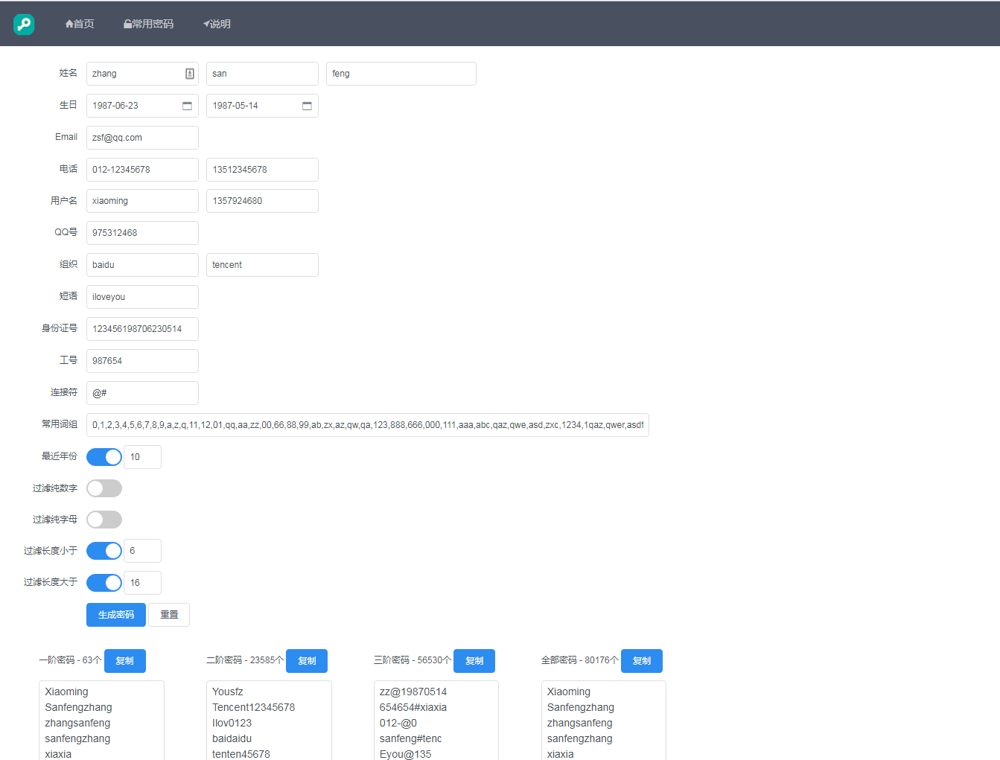

# SocialEngineeringDictionaryGenerator

## 简介

社会工程学密码生成器，是一个利用个人信息生成密码的工具，灵感源于亦思社会工程学字典生成器，但是该软件多年未更新，且生成的密码过少，故根据其构思重新做了一个。
本工具根据个人信息生成大量相关密码，既可以用于猜解他人密码，也可以用于校验自己密码的安全强度。

它根据输入的个人信息，将每条信息进行截取，然后与其他部分的信息进行排列组合（除了个人信息外还包含常用的字符组合如：abc，1qaz，qwer,1234等），生成多种人们可能使用的密码。
组合共分三阶：
一阶密码：仅根据一项个人信息生成的密码；
二阶密码：根据两项个人信息组合生成的密码；
三阶密码：由于部分人喜欢在两项个人信息中间加入一个特殊符号，以加强密码复杂度和强度，为了包含这种情况，故根据两项个人信息以及一个常用的连接符号（默认：.!_-#@:$&*~?%+=/|，***建议尽量减少连接符，否则会极大增加密码数量，甚至导致内存溢出从而生成失败**）生成三阶密码。

除了社会工程学密码以外，还提供了一些常用的弱密码（top100，csdn-top1700，常用10000，以及英国国家网络安全中心公布的10万个最常被黑的密码，更多密码字典可自行搜索），两者结合可以大幅提高密码破解概率。

为了安全起见，本程序不会记录任何日志，且代码开源于[我的Github](https://github.com/zgjx6/SocialEngineeringDictionaryGenerator)。

最后再附一个发现的同一个类型的网站 [http://www.bugku.com/mima](http://www.bugku.com/mima/), 以及[密码字典](https://github.com/r35tart/RW_Password)、[字典超超超全](https://pan.baidu.com/s/1PXkEo-Mk6AiFIBUUXhvhVg)-提取码:`tz2a`、[爆破字典](https://github.com/rootphantomer/Blasting_dictionary)。

## 网址

[社会工程学密码生成器](http://xingchen.pythonanywhere.com)

## 安装

本工具后端使用python的flask框架，前端使用vue和webpack。开发用的python版本为3.6，不再支持2.x版本。

安装步骤：

1. 安装python3.x。去官网下载安装即可。
2. 下载源码后，在命令行中执行`pip install -r requirements.txt`安装python的依赖库。
3. 在命令行中执行`python build/api.py`后打开浏览器，访问`http://127.0.0.1:5000/`即可。

编译前端：

src目录为前端源码，build目录为编译后的前端代码，如需修改前端代码，可参考如下步骤重新编译。

1. 安装nodejs和npm。[下载地址](http://nodejs.cn/)。
2. 在项目根目录下执行`npm install` 安装所有的依赖包。
3. 执行`npm run build`重新打包。另外，在开发过程中执行`npm run watch`可实时编译。

## 从docker启动

如果不从python启动, 也可以使用docker.  
安装好docker及docker-compose后, 在build目录中执行`docker-compose up -d`, 然后访问`127.0.0.1`即可。  

## 开源协议

[MIT License.](https://opensource.org/licenses/MIT)
