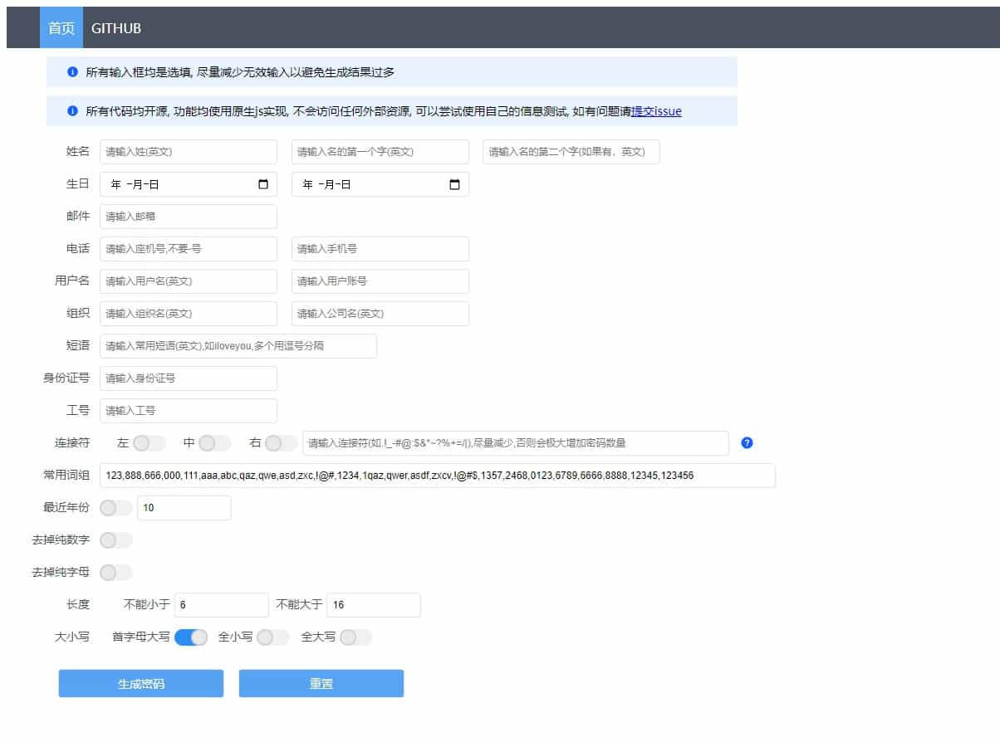

# SocialEngineeringDictionaryGenerator

## 简介

社会工程学密码生成器，是一个利用个人信息生成密码的工具，灵感源于亦思社会工程学字典生成器，但是该软件多年未更新，且生成的密码过少，故根据其构思重新做了一个。

所有代码均开源于[Github](https://github.com/zgjx6/SocialEngineeringDictionaryGenerator), 功能均使用原生js实现, 不会访问任何外部资源, 可以尝试使用自己的信息测试效果, 配合常用的弱密码效果更佳，如有问题请[提交issue](https://github.com/zgjx6/SocialEngineeringDictionaryGenerator/issues)。

## 使用

直接下载[index.html](https://github.com/zgjx6/SocialEngineeringDictionaryGenerator/blob/master/index.html)在浏览器打开即可

之前的python版本保留在了分支[python-1.0](https://github.com/zgjx6/SocialEngineeringDictionaryGenerator/tree/python-1.0)中，后续不再更新

## 开源协议

[MIT License.](https://opensource.org/licenses/MIT)
